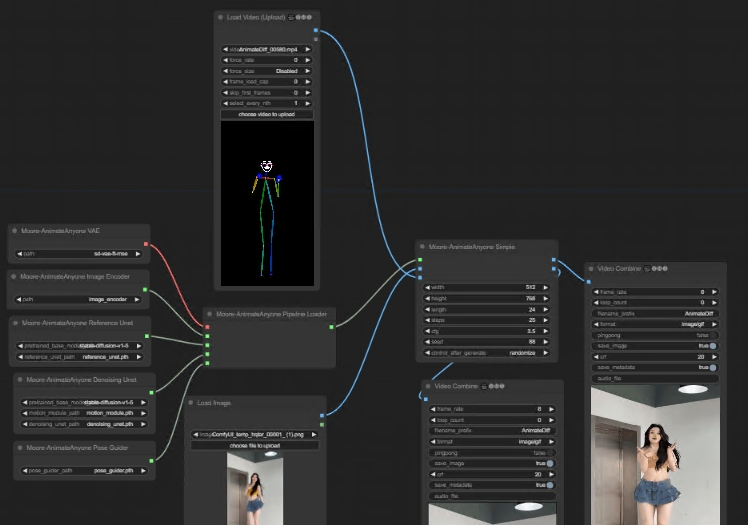

# This is an implementation of Moore-AnimateAnyone

[Moore-AnimateAnyone](https://github.com/MooreThreads/Moore-AnimateAnyone)

## Install

1. Clone this repo into custom_nodes directory of ComfyUI location

2. Run pip install -r requirements.txt

3. cd ComfyUI/custom_nodes/ComfyUI-Moore-AnimateAnyone & python tools/download_weights.py

## Examples

base workflow

https://github.com/chaojie/ComfyUI-Morre-AnimateAnyone/blob/main/workflow_moore_animateanyone.json
